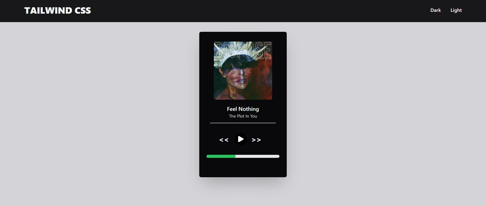

## Workshop Infinity School

### Tecnologia utilizada

### Sobre

Projeto feito para um workshop na escola Infinity School palestrado por mim. (Diêgo Sampaio Batista)
Fiz um card de música totalmente feito por HTML, Tailwind CSS e Javascript.
A parte de javascript foi apenas para mudar o tema de cores de dark para light ou vice versa.

### Como utilizar no seu PC

Primeiramente faça o clone baixando a pasta ou git clone
Após feito isso basta apenas abrir seu prompt de comando e baixar as depedencias do packjson.
##### npm install | npm -i
##### yarn install

### Screenshot's

#### Modo light

#### Modo dark

### Redes sociais

